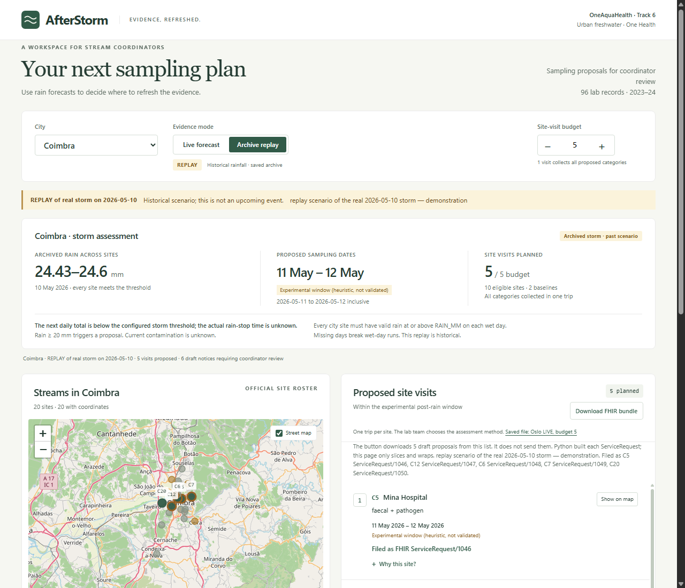
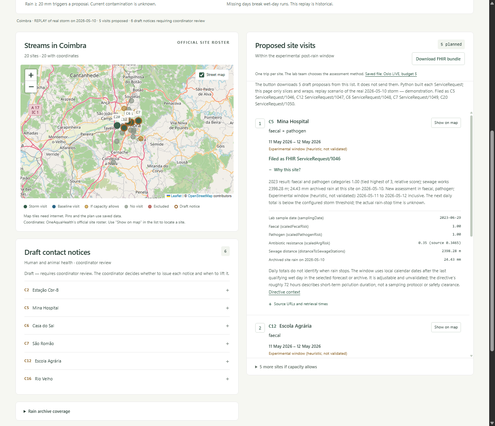
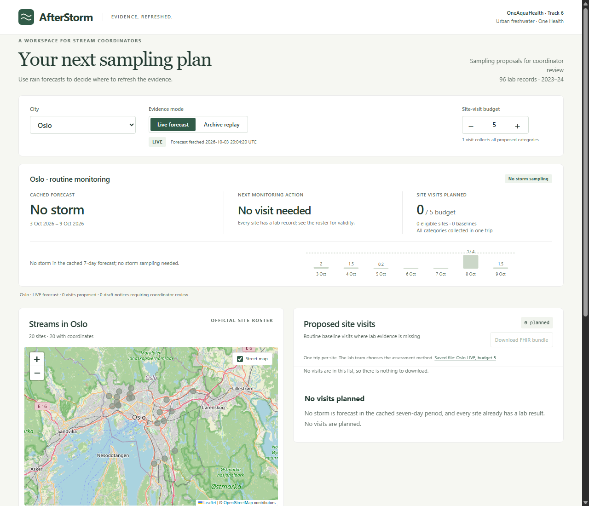
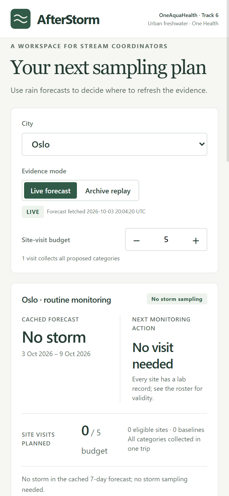

# AfterStorm

AfterStorm plans the sampling that refreshes the evidence. It is a Track 6 entry for the [OneAquaHealth IEEE Global Hackathon 2026](https://oneaquahealth-ieee-hackathon.devpost.com/).

A coordinator opens one city, sees a real heavy-rain day, and gets a short visit list: which official stream, which 2023 lab category to assess again (faecal, pathogen, or antibiotic resistance), and an experimental window of calendar dates. The same list can be filed as draft FHIR `ServiceRequest` proposals. The tool does not predict contamination and it does not publish a water-contact notice.

## Problem

The public Resilience Map has **96 lab records: 95 from 2023 and 1 from 2024** (Benevento site BN14, sampled 2024-08-05). The roster has **106 official sites**. **10 have no lab result:** C17, C18, G1, G17, G18, G19, G20, T15, T21, T24.

Rain still runs off streets and past sewage works into those streams. A coordinator who wants a new sample has to decide which site, which category, and which days, inside a small travel budget. The old category scores do not say what is in the water today.

## Solution

AfterStorm keeps the public records unchanged and proposes visits.

- **Live** uses one Open-Meteo 7-day forecast per city centre.
- **Replay** uses a real archived day when every site in that city had at least 20 mm of rain. The page labels it `REPLAY of real storm on YYYY-MM-DD`.

A day counts as heavy rain only at **20 mm or more**. That cut-off is a prototype setting in `config.json`, not a regulated warning level. 19.9 mm is not a storm day.

On a heavy-rain day the plan ranks sites that already have a lab record by the higher stored categories, then by nearer sewage works. Sites with no lab record are offered a first baseline sample of all three categories. The visit budget defaults to **5 site visits**. One visit collects every recommended category at that site. The lab team chooses the method. The scores are categories, not named assays.

The sampling dates are the **two local calendar days after the heavy-rain day** (D+1 through D+2). Daily totals do not say when the rain stopped. The label on every window is **Experimental window (heuristic, not validated)**. The EU Bathing Water Directive describes short-term pollution as lasting on the order of 72 hours. That duration is context for the window. It is not a sampling protocol and not a safety clearance.

If faecal or pathogen is at least 0.5, the plan drafts a contact notice: avoid water contact for people and pets until new results are reviewed. Status stays **draft**. A coordinator decides whether to send it and when to lift it. Nothing is sent automatically.

## Who it is for

City and project coordinators build the visit list. Lab teams choose how to analyse the samples. People and animals are the reason for the draft notice, and they see that notice only if a person issues it.

## Impact

The useful action is a new sample while the 2023 and 2024 records are still the latest public lab evidence. Faecal, pathogen, and antibiotic-resistance categories are the One Health link already present in the Resilience Map: germs and resistance genes in urban streams, beside people and pets. The draft notice is the protection step, and it stays with the coordinator.

No health outcome has been measured. There has been no field trial.

## Track

**Primary track: Track 6, Resilience Informatics.** The product is an early plan for the days after heavy rain: where to sample, which category, and a draft notice for human and animal contact.

The FHIR export is the interoperability piece. Each ranked visit is a base FHIR R4 `ServiceRequest` with `status = draft` and `intent = proposal`. The [OneAquaHealth Implementation Guide](https://build.fhir.org/ig/hl7-eu/oah/) was checked on 2026-10-04 (`hl7-eu/oah` master, 61 FSH files). It defines Group, Library, Location, Observation, and Specimen profiles. It has no ServiceRequest or Task profile, so these resources do not claim one.

## How this differs

Existing tools forecast risk or rank overdue sites from past data. AfterStorm plans the sampling that refreshes the evidence.

| Approach | What a coordinator gets |
| --- | --- |
| Forecast risk from weather or past labs | A prediction about contamination |
| Rank sites that look overdue in past data | A backward priority list |
| AfterStorm | A visit: site, category, experimental dates, inside a budget, filed as a draft request a person can approve |

## Replay storms in this cache

Each date is the latest archived day in that city when every site had rain of at least 20 mm. The window is the next two calendar days.

| City | Archived heavy-rain day | Experimental window |
| --- | --- | --- |
| Benevento | 2026-04-01 | 2026-04-02 to 2026-04-03 |
| Coimbra | 2026-05-10 | 2026-05-11 to 2026-05-12 |
| Ghent | 2025-07-06 | 2025-07-07 to 2025-07-08 |
| Oslo | 2026-06-09 | 2026-06-10 to 2026-06-11 |
| Toulouse | 2026-08-03 | 2026-08-04 to 2026-08-05 |

Coimbra replay, budget 5, proposes C5, C12, C6, C7, then C20. C5 (Mina Hospital) has faecal and pathogen both at 1, so the reason says those two categories are **tied highest**. Archived rain at C5 on 2026-05-10 was 24.43 mm. Sewage distance is 2398.28 m. The sample date is 2023-06-29.

## The committed forecast

Forecasts in this repository were fetched **2026-10-03T20:04:20Z** (Oslo file; the other four cities were fetched in the same run). The seven days are 3–9 October 2026. No city day in that cache reaches 20 mm. The highest days were Benevento 17.1 mm and Oslo 17.4 mm on 8 Oct, Ghent 18.0 mm on 8 Oct, Toulouse 9.3 mm on 7 Oct, and Coimbra 4.3 mm on 6 Oct.

LIVE therefore shows no storm sampling for that cache. Oslo and Benevento, where every site already has a lab record, plan no visits. Coimbra, Ghent, and Toulouse still list first-baseline visits for the sites with no lab result. Those visits are routine samples, not storm samples.

Run `python fetch.py` before a recording if you want a newer forecast. The page shows whatever forecast is in the cache. It does not keep a fixed weather sentence.

## Filed proposals

One bundle was posted, once: Coimbra replay, budget 5. Oslo LIVE was not posted. The sandbox returned:

| Site | ServiceRequest |
| --- | --- |
| C5 | [1046](https://sandbox.hl7europe.eu/oneaquahealth/fhir/ServiceRequest/1046) |
| C12 | [1047](https://sandbox.hl7europe.eu/oneaquahealth/fhir/ServiceRequest/1047) |
| C6 | [1048](https://sandbox.hl7europe.eu/oneaquahealth/fhir/ServiceRequest/1048) |
| C7 | [1049](https://sandbox.hl7europe.eu/oneaquahealth/fhir/ServiceRequest/1049) |
| C20 | [1050](https://sandbox.hl7europe.eu/oneaquahealth/fhir/ServiceRequest/1050) |

Posted at 2026-10-03T20:05:07Z. Each response was `201 Created`. On 2026-10-04 a direct read of ServiceRequest 1046 returned HTTP 200: `status` draft, `intent` proposal, subject identifier `https://api.enora-oah.eu/api/sites|C5`, occurrence 2026-05-11 to 2026-05-12. The note contains `replay scenario of the real 2026-05-10 storm — demonstration`. The same sentence is on the bundle tag and on each of the five notes.

The posted copy also points at sandbox Location/892 for C5, because the search returned exactly one Location with that site identifier. The files kept in this repository do not store `subject.reference`. The identifier is what lets a receiver match the official site code. Whether a Location reference resolves depends on the server. Sandbox coordinates are not used for the plan.

These ids are sandbox assignments. They are not certification. The HL7 validator jar was not run. Sandbox `$validate` was not called. The 22 checks that did run are listed in `docs/changes/readmeFHIR.md`: resource type, draft status, proposal intent, identifier system and site code, no reference in the saved file, category codes, dates, reason text, precautionary note, no Communication resource, no Good/Moderate/Poor wording, bundle shape, entry order, and the demonstration sentence limited to this Coimbra replay.

## Limitations

- The category numbers are relative scores from 2023 and 2024, not concentrations and not a current rating.
- The post-rain window is an experimental heuristic. The directive's roughly 72 hours describes how long short-term pollution may last. It is not a validated sampling window and not a clearance to enter the water.
- Recommended categories are not laboratory assays. The lab team chooses the method.
- Contact notices are drafts. They have no expiry timer. A person reviews them.
- Replay is a past archive day. Live is the cached forecast, and that forecast changes when it is fetched again.
- Visit order is greedy: higher stored category, then shorter sewage distance, then site code. Sites T21 and T24 have no sewage distance; they stay last among baselines and are not treated as zero metres.
- There has been no field validation.
- Map tiles need internet. If the tiles fail, the pins still use the official coordinates on a plain background. The plan itself is in the saved files.

## Data sources

| File under `data/raw/` | Source | Used for |
| --- | --- | --- |
| `sites.json` | [Official site roster](https://api.enora-oah.eu/api/sites/all) | Codes, names, coordinates, city centres. The only coordinate source. |
| `health-risks.json` | [Health-risk feed](https://api.enora-oah.eu/api/resilience-map/health-risks) | `scaledFecalRisk`, `scaledPathogenRisk`, `scaledArgRisk`, `samplingDate` |
| `urban-parameters.json` | [Urban parameters](https://api.enora-oah.eu/api/resilience-map/urban-parameters) | `distanceToSewageStations` |
| `weather/<code>.json` | Resilience Map weather archive | Replay rain, `precipTotalMm` |
| `forecasts/<city>.json` | [Open-Meteo daily forecast](https://open-meteo.com/en/docs) | Live rain, one forecast per city centre |
| `_manifest.json` | Written by `fetch.py` | URL, `fetched_at`, byte length, SHA-256 |

`python plan.py` reads that cache and does not call the network. It writes `web/data/plan.json` and `web/data/fhir-bundle.json`.

## Licences and data

The code in this repository is under the MIT licence. See `LICENSE`. The copyright holder is AfterStorm contributors, 2026.

The Geist fonts in `web/vendor/fonts/` are under the SIL Open Font License, Version 1.1. The licence text is `web/vendor/fonts/OFL.txt`.

Leaflet in `web/vendor/` is under the BSD 2-Clause licence. The licence text is `web/vendor/LICENSE.txt`.

The cached rows come from the OneAquaHealth public APIs in the table above. Forecast rows come from [Open-Meteo](https://open-meteo.com/) and are used under [CC BY 4.0](https://creativecommons.org/licenses/by/4.0/). Attribute them as weather data by Open-Meteo.com. Map tiles are © [OpenStreetMap](https://www.openstreetmap.org/copyright) contributors.

## Run

Python 3.11 or newer. This copy was run with Python 3.14. Standard library only. From `afterstorm/`:

```text
python test_plan.py
python plan.py
python -m http.server 8765 --bind 127.0.0.1 --directory web
```

Open [http://127.0.0.1:8765/?city=CO&mode=replay&visits=5](http://127.0.0.1:8765/?city=CO&mode=replay&visits=5) for the Coimbra replay. Open [http://127.0.0.1:8765/](http://127.0.0.1:8765/) for Oslo LIVE from the committed forecast.

`python fetch.py` refreshes the public sources and needs network. After it, run `python plan.py` again. Do not post another bundle. `python fhir_export.py --city CO --mode replay --budget 5 --post` now refuses, because `web/data/filed.json` already records ServiceRequests 1046–1050.

The download button on the page only slices the Python-built requests to the current budget and wraps them in a transaction Bundle. It does not create resource content and it does not send them.

## Screenshots

Coimbra replay of the real 2026-05-10 storm. The banner states that this is a demonstration. C5 is filed as ServiceRequest/1046.



The Why card for C5. Faecal and pathogen are both 1.00. Antibiotic resistance is shown as 0.35 with source 0.3465. Six draft notices sit beside the map, still unsent.



Oslo LIVE from the forecast fetched 2026-10-03T20:04:20Z. The chart's highest bar is 17.4 mm on 8 Oct, under the 20 mm line, so that cache schedules no storm visit. A newer fetch replaces this card. Read the card on the day you record.



The same Oslo cache on a 390-pixel-wide viewport.



## What is not in this repository

No public GitHub remote, no deployment, and no Devpost submission. `DEVPOST.md` and `VIDEO-SCRIPT.md` are the texts for those steps. Publishing waits for a separate approval.
