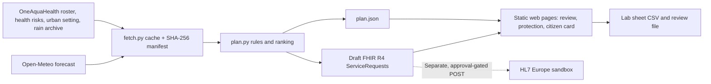
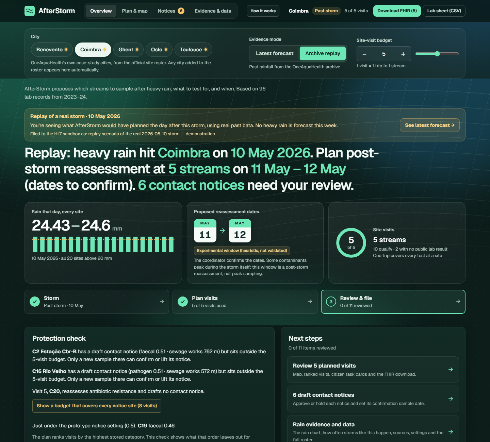
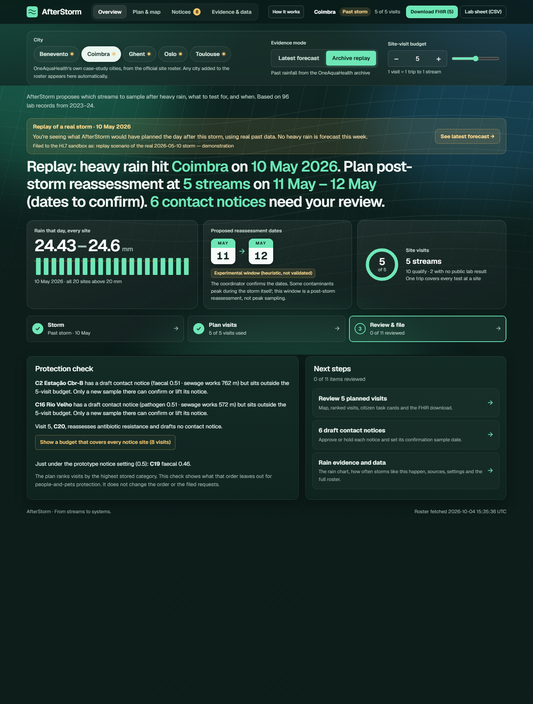
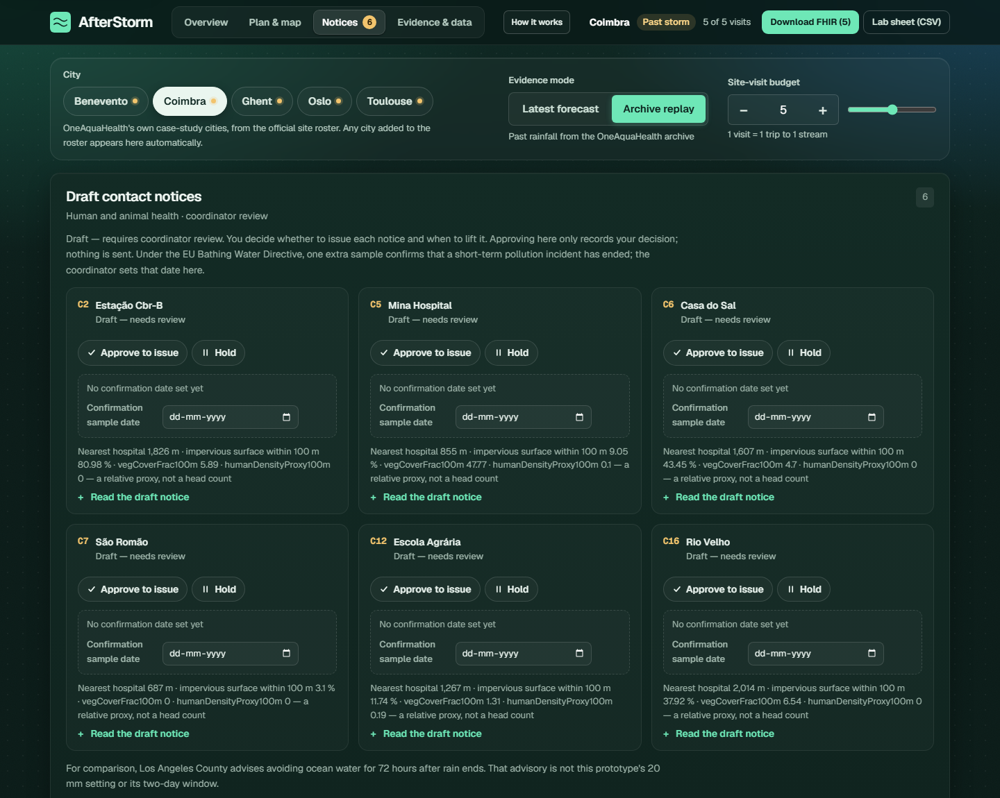
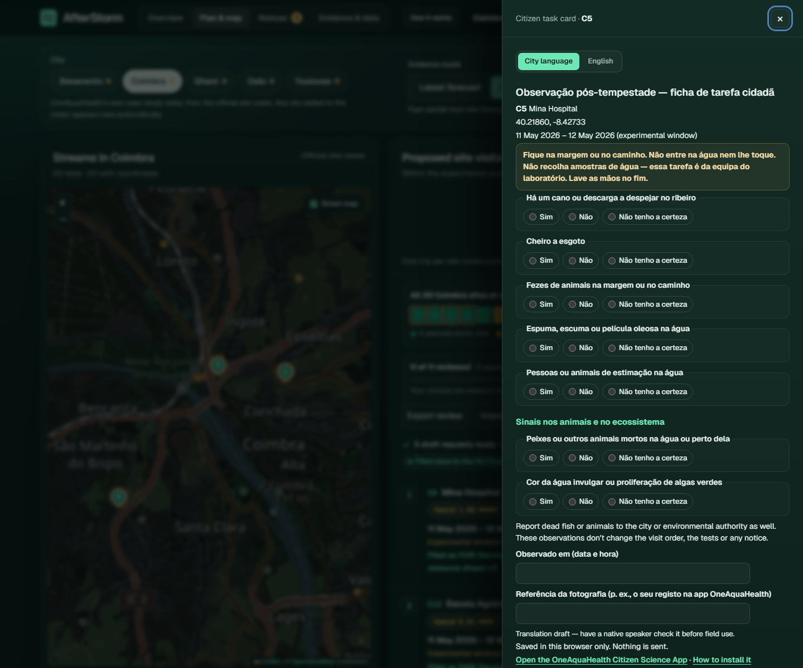
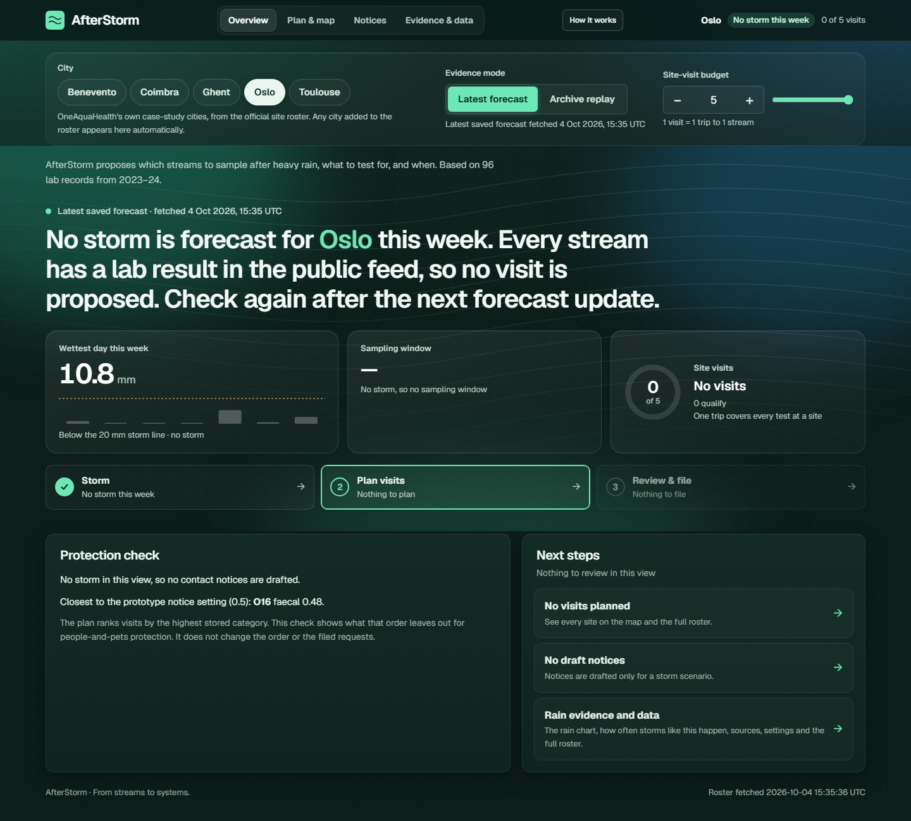

# AfterStorm

AfterStorm plans the sampling that refreshes the evidence. It is a Track 6 entry for the [OneAquaHealth IEEE Global Hackathon 2026](https://oneaquahealth-ieee-hackathon.devpost.com/).

[](https://github.com/AnkitAg80/afterstorm-oneaquahealth/actions/workflows/tests.yml)

## Try it in 60 seconds

[Open the public Coimbra replay](https://ankitag80.github.io/afterstorm-oneaquahealth/?city=CO&mode=replay&visits=5&guide=0) or [the latest saved Oslo forecast](https://ankitag80.github.io/afterstorm-oneaquahealth/?city=OS&mode=live&visits=5&guide=0). The replay opens on the real archived storm of **10 May 2026**. Try three actions: open the **Protection check** and raise the budget to cover every notice site; open C5's **Task card** in Portuguese; download the **Lab sheet (CSV)**. Use **How it works** for a three-step orientation.

A coordinator opens one city, sees a real heavy-rain day, and gets a short visit list: which official stream, which 2023 lab category to assess again (faecal, pathogen, or antibiotic resistance), and an experimental window of calendar dates. The same list can be filed as draft FHIR `ServiceRequest` proposals. The tool does not predict contamination and it does not publish a water-contact notice.

## Problem

The public Resilience Map has **96 lab records: 95 from 2023 and 1 from 2024** (Benevento site BN14, sampled 2024-08-05). The roster has **106 official sites**. **10 have no lab result:** C17, C18, G1, G17, G18, G19, G20, T15, T21, T24.

Rain still runs off streets and past sewage works into those streams. A coordinator who wants a new sample has to decide which site, which category, and which days, inside a small travel budget. The old category scores do not say what is in the water today.

## Solution

AfterStorm keeps the public records unchanged and proposes visits.

- **Live** uses one Open-Meteo 7-day forecast per city centre.
- **Replay** uses a real archived day when every site in that city had at least 20 mm of rain. The page labels it `REPLAY of real storm on YYYY-MM-DD`.

A day counts as a storm day only at **20 mm or more**. That matches the WMO/ETCCDI "very heavy precipitation day" index (R20mm: daily rain of at least 20 mm; [ETCCDI index list](https://etccdi.pacificclimate.org/list_27_indices.shtml)). It is still a prototype setting in `config.json`, not a regulated warning level: our rain data are daily totals, so hourly intensity (for example the 7.6 mm per hour heavy-rain rate) can't be checked, and each city should calibrate the trigger locally. 19.9 mm is not a storm day.

On a heavy-rain day the plan ranks sites that already have a lab record by the higher stored categories, then by nearer sewage works. Sites with no lab record are offered a first baseline sample of all three categories. The visit budget defaults to **5 site visits**. One visit collects every recommended category at that site. The lab team chooses the method. The scores are categories, not named assays.

The sampling dates are the **two local calendar days after the heavy-rain day** (D+1 through D+2). Daily totals do not say when the rain stopped. The label on every window is **Experimental window (heuristic, not validated)**. The EU Bathing Water Directive describes short-term pollution as lasting on the order of 72 hours. That duration is context for the window. It is not a sampling protocol and not a safety clearance.

If faecal or pathogen is at least 0.5, the plan drafts a contact notice: avoid water contact for people and pets until new results are reviewed. Status stays **draft**. A coordinator decides whether to send it and when to lift it. Nothing is sent automatically.

## Who it is for

City and project coordinators build the visit list. Lab teams choose how to analyse the samples. People and animals are the reason for the draft notice, and they see that notice only if a person issues it.

## Impact

The useful action is a new sample while the 2023 and 2024 records are still the latest public lab evidence. Faecal, pathogen, and antibiotic-resistance categories are the One Health link already present in the Resilience Map: germs and resistance genes in urban streams, beside people and pets. The draft notice is the protection step, and it stays with the coordinator.

No health outcome has been measured. There has been no field trial.

## Context

WHO's 2021 recreational water guidelines recommend warning water users when rain may raise faecal indicators, before a new lab result exists; AfterStorm drafts such a notice for a coordinator to review. [WHO guidelines](https://www.who.int/publications/i/item/9789240031302)

Berlin's FLUSSHYGIENE work samples rivers after rain and then runs a forecast model; storm samples like the ones AfterStorm plans are what such a model would need. AfterStorm does not run that forecast. [FLUSSHYGIENE project](https://bmbf.nawam-rewam.de/en/projekt/flusshygiene/)

Under the EU Bathing Water Directive, one extra sample confirms that a short-term pollution incident has ended; AfterStorm lets the coordinator plan that confirmation sample. [Directive 2006/7/EC, Annex IV.4](https://eur-lex.europa.eu/eli/dir/2006/7/oj)

These are examples of a human review workflow. The prototype does not determine bathing-water status or issue an advisory.

## What's new in AfterStorm

- A forecast or archived storm becomes a **post-storm reassessment plan** under a fixed site-visit budget.
- The **Protection check** names draft-notice sites outside the budget and offers the budget needed to include them, without changing the ranking.
- **Evidence-bound review** marks an approval stale when its site, category, timing or notice evidence changes; colleagues can exchange review files without a server.
- Each draft notice can record a **confirmation-sample date**, following the lifecycle in the EU Bathing Water Directive. This date is a proposal for a coordinator, not a clearance.
- **Citizen task cards** in the city's language ask safe bank-side questions about human contact, animal mortality and ecosystem signs, and link to the official OneAquaHealth Citizen Science App. The translations are drafts.

## Track

**Primary track: Track 6, Resilience Informatics.** The product is an early plan for the days after heavy rain: where to sample, which category, and a draft notice for human and animal contact.

The FHIR export is the interoperability piece. Each ranked visit is a base FHIR R4 `ServiceRequest` with `status = draft` and `intent = proposal`. The [OneAquaHealth Implementation Guide](https://build.fhir.org/ig/hl7-eu/oah/) was checked on 2026-10-04 (`hl7-eu/oah` master, 61 FSH files). It defines Group, Library, Location, Observation, and Specimen profiles. It has no ServiceRequest or Task profile, so these resources do not claim one.

## How this differs

Other tools forecast risk or rank overdue sites from past data. AfterStorm turns a storm into a reviewable post-storm reassessment plan with a fixed visit budget, shows what that budget leaves out for protection, gives citizens a safe bank-side task, and ends each notice with a planned confirmation sample.

| Approach | What a coordinator gets |
| --- | --- |
| Forecast risk from weather or past labs | A prediction about contamination |
| Rank sites that look overdue in past data | A backward priority list |
| AfterStorm | A visit: site, category, experimental dates, inside a budget, filed as a draft request a person can approve |

## How a city adopts this

The prototype uses OneAquaHealth's public site, health-risk, urban-setting and weather-archive feeds plus Open-Meteo. The official roster supplies all **106 sites across five OneAquaHealth case-study cities** without per-city setup. The site is static, so it needs no application server or database. It hands off to existing work through a lab-sheet CSV, draft FHIR R4 ServiceRequests, downloadable review files, and a link to the official Citizen Science App; no data is sent to that app by this page.

A practical pilot would start with one city's coordinator and an ecologist calibrating the **20 mm** and **0.5** prototype settings. Volunteers could record their observations in the official app while the lab team collects samples. A city that publishes sewer-overflow alerts could add those as a second trigger. Later, measured storm samples could support a forecast model such as FLUSSHYGIENE's; AfterStorm itself does not run one.



## Replay storms in this cache

Each date is the latest archived day in that city when every site had rain of at least 20 mm. The window is the next two calendar days.

| City | Archived heavy-rain day | Experimental window |
| --- | --- | --- |
| Benevento | 2026-04-01 | 2026-04-02 to 2026-04-03 |
| Coimbra | 2026-05-10 | 2026-05-11 to 2026-05-12 |
| Ghent | 2025-07-06 | 2025-07-07 to 2025-07-08 |
| Oslo | 2026-06-09 | 2026-06-10 to 2026-06-11 |
| Toulouse | 2026-08-03 | 2026-08-04 to 2026-08-05 |

Coimbra replay, budget 5, proposes C5, C12, C6, C7, then C20. C5 (Mina Hospital) has faecal and pathogen both at 1, so the reason says those two categories are **tied highest**. Archived rain at C5 on 2026-05-10 was 24.43 mm. Sewage distance is 2398.28 m. The sample date is 2023-06-29.

## Latest saved forecast

LIVE uses the most recent successful forecast saved in this repository. The page displays the **fetched-at time** beside the mode and answer. Forecasts change, so a video must read the live card rather than use a memorised weather sentence. When no storm is forecast, only streams with no lab result in the public feed can receive first-baseline visits. The replay remains a separate real archived storm, not a forecast.

The final refresh on **2026-10-04** fetched Oslo at **15:35:54 UTC**. Its saved 4–10 October forecast peaks at **10.8 mm on 8 October**, below the 20 mm trigger, so Oslo LIVE proposes zero visits. None of the five saved city forecasts currently has a qualifying storm. A previously observed Oslo forecast of 42.9 mm for 8 October is no longer the latest saved forecast; the demo must use the current card.

## Filed proposals

One bundle was posted, once: Coimbra replay, budget 5. Oslo LIVE was not posted. The sandbox returned:

| Site | ServiceRequest |
| --- | --- |
| C5 | [1046](https://sandbox.hl7europe.eu/oneaquahealth/fhir/ServiceRequest/1046) |
| C12 | [1047](https://sandbox.hl7europe.eu/oneaquahealth/fhir/ServiceRequest/1047) |
| C6 | [1048](https://sandbox.hl7europe.eu/oneaquahealth/fhir/ServiceRequest/1048) |
| C7 | [1049](https://sandbox.hl7europe.eu/oneaquahealth/fhir/ServiceRequest/1049) |
| C20 | [1050](https://sandbox.hl7europe.eu/oneaquahealth/fhir/ServiceRequest/1050) |

Posted at 2026-10-03T20:05:07Z. Each response was `201 Created`. On 2026-10-04 a direct read of ServiceRequest 1046 returned HTTP 200: `status` draft, `intent` proposal, subject identifier `https://api.enora-oah.eu/api/sites|C5`, occurrence 2026-05-11 to 2026-05-12. The note contains `replay scenario of the real 2026-05-10 storm — demonstration`. The same sentence is on the bundle tag and on each of the five notes.

The posted copy also points at sandbox Location/892 for C5, because the search returned exactly one Location with that site identifier. The files kept in this repository do not store `subject.reference`. The identifier is what lets a receiver match the official site code. Whether a Location reference resolves depends on the server. Sandbox coordinates are not used for the plan.

These ids are sandbox assignments, not certification. They were **filed with resource shape v1**. The current export uses **resource shape v2**: one request-type `code`, with assessment categories in `orderDetail`. A separate five-entry Coimbra replay v2 bundle was validated with the official HL7 FHIR validator against **core R4 4.0.1** on **2026-10-04**: **0 errors, 17 warnings, 8 information**. All warnings and information concern undefined local `urn:afterstorm:*` CodeSystems. See [the console report](docs/validation/fhir-r4-core.txt) and [the generated OperationOutcome](docs/validation/fhir-r4-core.html). The OneAquaHealth IG package URL returned 404, so profile conformance was **not** checked; the IG also defines no ServiceRequest profile. No v2 bundle was posted to the sandbox.

## Limitations

- The category numbers are relative scores from 2023 and 2024, not concentrations and not a current rating.
- The post-rain window is an experimental heuristic. The directive's roughly 72 hours describes how long short-term pollution may last. It is not a validated sampling window and not a clearance to enter the water.
- Recommended categories are not laboratory assays. The lab team chooses the method.
- Contact notices are drafts. They have no expiry timer. A person reviews them.
- Replay is a past archive day. Live is the cached forecast, and that forecast changes when it is fetched again.
- The 20 mm rain trigger and 0.5 notice setting are prototype settings. The experimental window may miss peaks during the storm itself.
- Visit order is greedy: higher stored category, then shorter sewage distance, then site code. Sites T21 and T24 have no sewage distance; they stay last among baselines and are not treated as zero metres.
- Reviews, confirmation dates, and citizen answers are saved in the browser and shared **by file only**. No server synchronizes them.
- The urban density field is a source proxy, **not a head count**. Citizen-card translations are drafts.
- There has been no field validation or user test yet.
- Map tiles need internet. If the tiles fail, the pins still use the official coordinates on a plain background. The plan itself is in the saved files.

## Data sources

| File under `data/raw/` | Source | Used for |
| --- | --- | --- |
| `sites.json` | [Official site roster](https://api.enora-oah.eu/api/sites/all) | Codes, names, coordinates, city centres. The only coordinate source. |
| `health-risks.json` | [Health-risk feed](https://api.enora-oah.eu/api/resilience-map/health-risks) | `scaledFecalRisk`, `scaledPathogenRisk`, `scaledArgRisk`, `samplingDate` |
| `urban-parameters.json` | [Urban parameters](https://api.enora-oah.eu/api/resilience-map/urban-parameters) | `distanceToSewageStations` |
| `weather/<code>.json` | Resilience Map weather archive | Replay rain, `precipTotalMm` |
| `forecasts/<city>.json` | [Open-Meteo daily forecast](https://open-meteo.com/en/docs) | Live rain, one forecast per city centre |
| `_manifest.json` | Written by `fetch.py` | URL, `fetched_at`, byte length, SHA-256 |

`python plan.py` reads that cache and does not call the network. It writes `web/data/plan.json` and `web/data/fhir-bundle.json`.

## Licences and data

The code in this repository is under the MIT licence. See `LICENSE`. The copyright holder is AfterStorm contributors, 2026.

The Geist fonts in `web/vendor/fonts/` are under the SIL Open Font License, Version 1.1. The licence text is `web/vendor/fonts/OFL.txt`.

Leaflet in `web/vendor/` is under the BSD 2-Clause licence. The licence text is `web/vendor/LICENSE.txt`.

The cached rows come from the OneAquaHealth public APIs in the table above. Forecast rows come from [Open-Meteo](https://open-meteo.com/) and are used under [CC BY 4.0](https://creativecommons.org/licenses/by/4.0/). Attribute them as weather data by Open-Meteo.com. Map tiles are © [OpenStreetMap contributors](https://www.openstreetmap.org/copyright). CARTO's dark layer was tested but its [new key requirement](https://www.carto.com/basemaps/apikey/) made it unsuitable for this keyless static demo.

## Run

Python 3.11 or newer. This copy was run with Python 3.14. Standard library only. From `afterstorm/`:

```text
python test_plan.py
python test_fetch.py
python test_labsheet.py
python plan.py
python -m http.server 8765 --bind 127.0.0.1 --directory web
```

Open [http://127.0.0.1:8765/](http://127.0.0.1:8765/) for Coimbra replay by default. To inspect the saved Oslo forecast, open [Oslo LIVE](http://127.0.0.1:8765/?city=OS&mode=live&visits=5&guide=0).

`python fetch.py` refreshes the public sources and needs network. After it, run `python plan.py` again. Do not post another bundle. `python fhir_export.py --city CO --mode replay --budget 5 --post` now refuses, because `web/data/filed.json` already records ServiceRequests 1046–1050.

The download button on the page only slices the Python-built requests to the current budget and wraps them in a transaction Bundle. It does not create resource content and it does not send them. Current checks: **14 fetch tests, 24 assert-based planning checks, and the browser-generated CSV check**. GitHub Actions runs the tests on each push to `main`.

## Screenshots

These captures use the final saved cache and `?guide=0` for an unobstructed demo:











The phone layout was checked in a browser at 390 CSS pixels: the page has no document-level horizontal overflow, and the guide becomes a bottom sheet. The headless Chrome narrow-screen capture is cropped by its minimum window width, so it is not used as layout evidence here.

## Submission status

The [source repository](https://github.com/AnkitAg80/afterstorm-oneaquahealth) and [GitHub Pages demo](https://ankitag80.github.io/afterstorm-oneaquahealth/) are public. `DEVPOST.md` and `VIDEO-SCRIPT.md` are the prepared submission text and video outline. A Devpost submission and demo video are not included in this repository.
